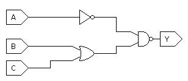
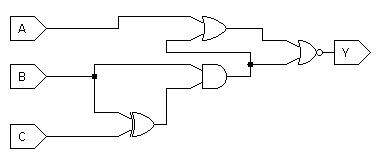

We will discuss some of these questions in class if time permits.
Otherwise, you can consider them extra, not-for-credit practice questions that
will help with understanding course material and studying for the exam.

No need to report the answers to me --
this is just for practice and will not be graded.
I will not be releasing answers for them,
but I am happy to discuss them in office hours if you want to review any of
them.

Note: some questions are taken entirely or in part from your textbook.

# General Questions

1. Describe what it means for a circuit to be combinational.

2. Give an example of a circuit that is *not* combinational.
   How would you demonstrate that it is not combinational?

3. How many rows are there in a truth table with 6 inputs?

4. Give one possible Boolean expression for the circuit above.

5. Write the truth table for the circuit above.

6. Use your truth table to write the SOP form of the Boolean expression.

7. Draw the PLA-style circuit for the following truth table:

A | B | C | Y |
--- | --- | --- | --- |
0 | 0 | 0 | 1 |
0 | 0 | 1 | 0 |
0 | 1 | 0 | 0 |
0 | 1 | 1 | 0 |
1 | 0 | 0 | 0 |
1 | 0 | 1 | 0 |
1 | 1 | 0 | 1 |
1 | 1 | 1 | 0 |

10. For the two circuits above,
determine whether or not each is combinational and explain why or why not.

11. Assume you know that {AND, OR, NOT} is logically complete.
Show that {AND, NOT} is logically complete.
    * First, recall what you need to do to prove a set is logically complete
    given another set that is logically complete.
    * Then, use the second of
    [De Morgan's laws](https://en.wikipedia.org/wiki/De_Morgan%27s_laws#Engineering)
    to help.

<!--
Other questions if time permits:
* Design a circuit that outputs "true" if a given day of the week (Sun-Sat) is
  part of the weekend (Saturday and Sunday only; not Friday).
  Otherwise, the circuit outputs "false".
  * How many bits of input should your circuit have?
  * How are the days encoded?
  * Given your answers to the two questions above, draw the circuit.

* The following truth table has two inputs and two outputs.
  Draw the corresponding circuit.
  *Hint:* You can essentially draw separate circuits for Y and Z and connect
  the *inputs* of the circuits to each other.

A | B | Y | Z |
--- | --- | --- | --- |
0 | 0 | 0 | 0 |
0 | 1 | 1 | 1 |
1 | 0 | 0 | 1 |
1 | 1 | 1 | 0 |
-->
