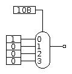

In your groups, answer the following questions.
No need to report the answers to me --
this is just for practice.
We may not get through all of the questions every week.
You may want to take notes during the discussion,
because these questions will be helpful in reviewing for exams.

I will be dropping in and out of rooms to facilitate to the discussions and in
case you have any questions.
Think of it like me walking around the classroom and listening to different
groups.
Again, this isn't meant to be for a grade,
so don't be concerned about giving a wrong answer even if I am in the room.
You can also flag me down in Zoom if you have a question even if I'm not in the
room
(I think the button in Zoom looks like a question mark).

Note: some questions are taken entirely or in part from your textbook.

# General Questions

1. Consider 3 sports: javelin, soccer, and baseball.
Draw a circuit that determines whether a given sport requires a ball.
This needs to occur in two steps:
* Choose a representation for the foods that a circuit will understand.
There is no single correct representation,
though some might be easier to work with.
* Draw the circuit. Writing a truth table first may be helpful.
Your circuit can output either True or False if an invalid input is given --
i.e., don't worry about invalid inputs for this question


2. Assume all gates cause a delay of 10 nanoseconds.
What is the critical path through the circuit above?

3. Assume NOT gates cause a delay of just 3 nanoseconds,
but all other gates cause a delay of 10 nanoseconds.
Does that change the critical path through the circuit above?
Why or why not?

4. Consider the following mux and inputs.
Note that the selector input is given in binary (hence the `B`).
What is the output?
How could you change the selector to get a different output?



<!-- ascii mux
```
    01
    |
   |-
 1-| \
 0-| |
 0-| |---
 0-| /
   |-

```
-->

5. Consider a circuit with two inputs: `Num` (two bits) and `DoNot` (one bit).
If `DoNot` is 0, the circuit outputs `Num`.
Otherwise, the circuit outputs the bitwise NOT of `Num`.
Create the circuit described using only muxes and NOT gates.

6. If `Num` were considered as a two's complement binary number,
would the circuit above compute `-Num` when `DoNot` was `1`?
Why or why not?

7. Represent the Boolean expression
`A + (B xor C)`
using only a multiplexor.

8. Consider representing the Boolean expression
`(A + B)*(C + ~A) + D + (E*F) + (F xor G)`
using a multiplexor.
    * how many selector inputs would be required?
    * how many data inputs?

9. Why might representing the expression above using a multiplexor be a bad
idea?
How does this relate to truth tables?

10. Your lab partner wants to speed up your 16-bit adder using the following
idea:
   * use two 16-bit ripple-carry adders,
   one with a carry-in of 1 and the other with a carry-in of 0
   * attach the outputs to multiplexors and use the actual carry in as the
   selector for the muxes
How would you explain to them that this is a bad idea?
How could the idea be improved?

11. Given `G3:2`, `G_1:0`, `P_3:2`, `P_1:0`, and a carry-in `C_in`,
give a Boolean expression to determine `C_3`.
That is, if you know the generate and propogate logic for 2-bit blocks,
how can you determine the carry-out for the combined 4-bit block?
(Hint: The expression should look familiar.)
