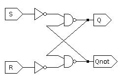

In your groups, answer the following questions.
No need to report the answers to me --
this is just for practice.
We may not get through all of the questions every week.
You may want to take notes during the discussion,
because these questions will be helpful in reviewing for exams.

I will be dropping in and out of rooms to facilitate to the discussions and in
case you have any questions.
Think of it like me walking around the classroom and listening to different
groups.
Again, this isn't meant to be for a grade,
so don't be concerned about giving a wrong answer even if I am in the room.
You can also flag me down in Zoom if you have a question even if I'm not in the
room
(I think the button in Zoom looks like a question mark).

Note: some questions are taken entirely or in part from your textbook.

# General Questions

1. Consider the Boolean expression
```
A'B'C' + A'BC' + A'B'C + AB'C
```
Simplify this expression using a K-map.
You may check your work using Boolean algebra,
but you will need to know how to draw and circle a K-map for the exam.

2. Describe in your own words the fundamental difference between combinational
circuits and sequential circuits.

3. What relatively simple test can we perform to determine whether a circuit
is combinational?

4. Why is it not possible to represent sequential circuits using truth tables?

5. Can all sequential circuits be described with Boolean algebra?
If not, can you come up with an example of why this does not work?

6. When filling out the characteristic table for the SR latch in lecture,
we assumed that the outputs `Q` and `Qnot` always started as opposites.
How can we force the circuit into a state where that is not the case?

7. Consider the two diagrams below.
The first is the standard SR latch.
The second is wired the same, but with the `Qnot` output removed.
Will the circuit in the second diagram behave the same as the circuit in the
first diagram?


8. Consider the diagram below.
Is the circuit in this diagram an SR latch?
That is, if we treated it as a black box and considered only its inputs and
outputs,
would it behave the same way as the circuit we have been studying?
(Hint: how can we characterize the behavior of a sequential circuit?)



9. The output of a D latch is currently 0.
Describe what must be done to make the output 1.

10. Assume the input to a latch is controlled by combinational logic that takes
40 ns to reach a steady state from when its own inputs are updated.
During that time, its output(s) may glitch.
Why is this a problem for an SR latch?
How can a D latch handle this problem?
