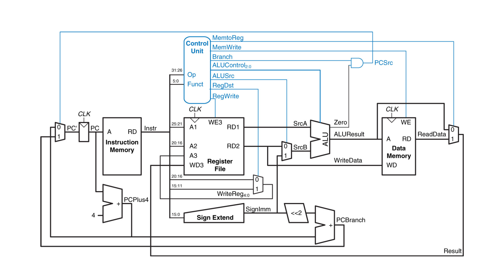

In your groups, answer the following questions.
No need to report the answers to me --
this is just for practice.
We may not get through all of the questions every week.
You may want to take notes during the discussion,
because these questions will be helpful in reviewing for exams.

I will be dropping in and out of rooms to facilitate to the discussions and in
case you have any questions.
Think of it like me walking around the classroom and listening to different
groups.
Again, this isn't meant to be for a grade,
so don't be concerned about giving a wrong answer even if I am in the room.
You can also flag me down in Zoom if you have a question even if I'm not in the
room
(I think the button in Zoom looks like a question mark).

Note: some questions are taken entirely or in part from your textbook.

# General Questions

1. Why does a jump instruction need to store the address in a "funny" way?
Why not just encode the entire address in the instruction?

2. What is the value of the immediate stored in the jump instruction in the
following code snippet?
```
0x00400000 |       j place
0x00400004 |       addi $t0, $0, 1
0x00400008 |       addi $t1, $0, 2
0x0040000C |       and $t2, $t0, $t1
0x00400010 | place: or $t3, $t0, $t1
0x00400014 |       xor $t4, $t0, $t1
```

3. Why can a jump move farther than a branch?

4. Write the following in assembly.
```python
x = 8
if x < 10:
    y = 5
else:
    y = 6
```

5. Write the following in assembly.
```python
x = 8
if x < 2*x:
    y = 5
else:
    y = 6
```

6. Write the following in assembly.
```python
x = 8
y = 0
while x > 1:
    y = y + x
    x = x/2
```

For the next two questions,
consider the MIPS microarchitecture diagram from lecture,
reproduced below.
(This image comes from your textbook.)



7. The diagram as shown does not actually work for `sll` (shift left logical).
Why not?
Describe briefly what you would need to do to add the ability to perform `sll`
with the circuit.

8. Describe the purpose of the AND gate in the upper right part of the diagram
and how it accomplishes that purpose.
Note that I'm not asking how an AND gate works --
what problem does the gate solve for the circuit as a whole?

9. Open up the
[assembly and memory handout](/misc/assembly-and-memory.pdf)
and work through as much as you can.
